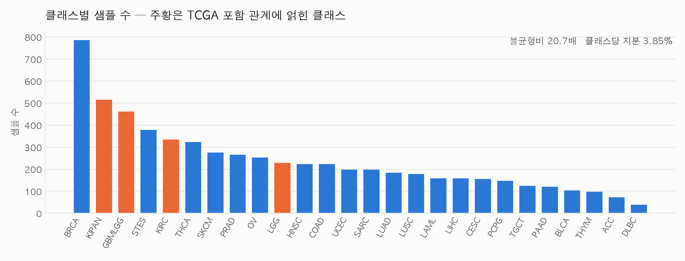
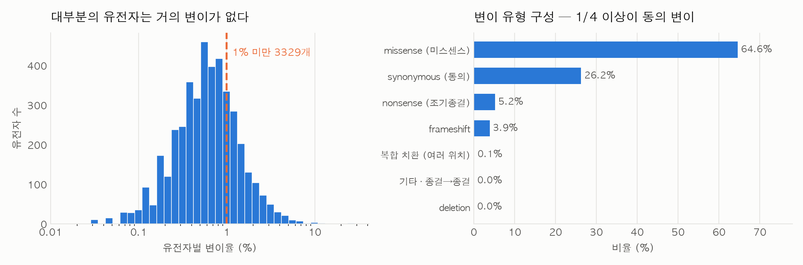
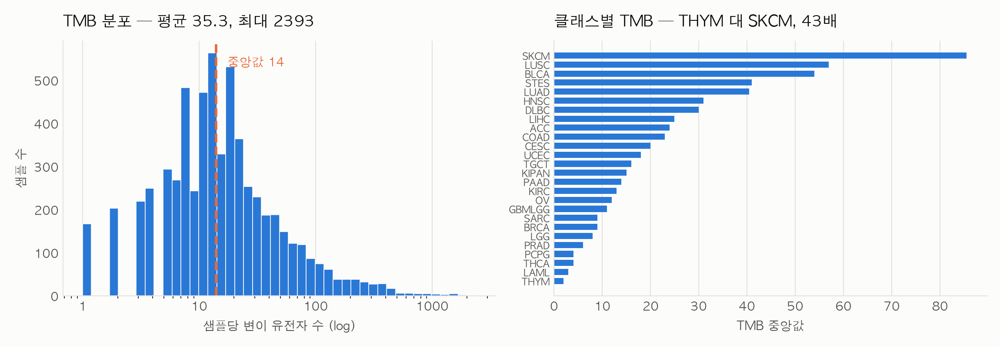
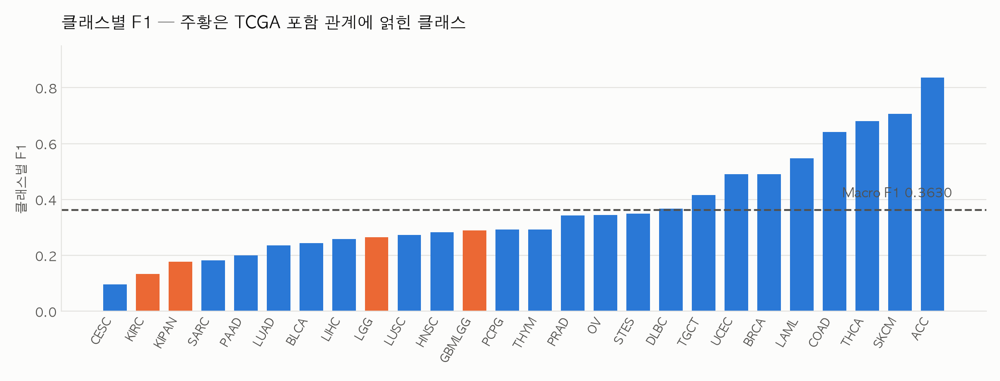

# EDA 상세 보고서 — 암 환자 유전체 변이 정보 기반 암종 분류

| | |
|---|---|
| **작성자** | member_d (권일준) |
| **작성일** | 2026-07-30 |
| **원본 노트북** | `experiments/member_d/notebooks/01_eda.ipynb` (61셀 · 8섹션) |
| **기준 실험** | `member-d-logreg-001` |
| **검증 방식** | `StratifiedKFold(n_splits=5, shuffle=True, random_state=42)` |
| **실행 환경** | macOS · Python 3.12.13 · numpy 2.5.1 · pandas 2.3.3 · scikit-learn 1.9.0 |

이 문서는 **팀원이 바로 작업에 쓰는 것**을 목적으로 합니다. 모든 수치는 노트북 실행 결과이고,
각 절 끝에 **"그래서 뭘 해야 하는가"** 를 적었습니다.

---

## 0. 한 장 요약

| | |
|---|---|
| 데이터 | train 6,201행 × 유전체 4,384열 · test 2,546행 · 26 클래스 |
| 베이스라인 | **Macro F1 0.36305** · Accuracy 0.36026 (LogReg balanced, 4,231 피처) |
| 최대 병목 | TCGA **포함 관계** 4클래스 — Macro F1의 **15.4%** 를 통째로 잃는 중 |
| 두 번째 병목 | 전용 마커 0개인 6클래스 — Macro F1의 **23%** |
| 가장 확실한 개선 | 변이 **위치** 정보 복원 (BRAF V600E 57.3% vs V600K 0.0%) |
| 필수 설정 | `class_weight="balanced"` — 빼면 Macro F1 −0.032 |
| 숨은 함정 | test에만 결측 237개 → `fillna("WT")` 없으면 128행 조용히 오염 |

**한 문장으로** — 지금 모델은 "어떤 유전자에 변이가 있나"만 보고 있고,
**"어느 위치의 어떤 변이인가"** 와 **"이 라벨이 다른 라벨을 포함하는가"** 를 모릅니다.
남은 성능의 대부분이 그 두 곳에 있습니다.

---

## 1. 이 문서를 재현하는 법

```bash
# 레포 루트에서
source .venv/bin/activate
jupyter lab
# experiments/member_d/notebooks/01_eda.ipynb 열고 Run All
```

- 소요 시간: 약 2분 (Section 6의 CV 4회가 대부분)
- 산출물은 `experiments/member_d/notebooks/artifacts/` 에 떨어집니다
- 제출 파일과 지표는 `experiments/member_d/results/member-d-logreg-001/` 에 생성됩니다

> **수치가 소수점 넷째 자리에서 다르게 나와도 정상입니다.** 이유는 9절을 보세요.

---

## 2. 데이터 구조 — 시작 전에 확인해야 할 것

### 2.1 크기와 스키마

| 항목 | 값 |
|---|---|
| `train.shape` | (6201, 4386) — ID + SUBCLASS + 유전체 4,384 |
| `test.shape` | (2546, 4385) |
| `submission.shape` | (2546, 2) |
| 클래스 수 | 26 |
| train/test 컬럼 이름·순서 | 동일 |
| test ID ↔ submission ID | 순서까지 동일 |

> **대회 설명문의 "6,199개 유전자"는 실제와 다릅니다.** 파일 기준 유전체 컬럼은 **4,384개**입니다.
> 문서가 아니라 `df.shape` 를 믿으세요.

### 2.2 🚨 test에만 결측치 237개

train은 **0개**, test는 **237개** (25개 컬럼 · 128개 행 · 행당 최대 5개). 최다는 `CNOT2` 77, `TNFAIP6` 65.

전처리를 `!= "WT"` 로만 짜면 **NaN이 조용히 "변이 있음(True)"** 이 됩니다.
train에 결측이 없으니 **학습 중에도, CV 점수에서도 절대 드러나지 않고**, test 추론에서만 128개 행이 오염됩니다.
리더보드 점수만 이유 없이 깎이고 원인을 못 찾는 종류의 버그입니다.

**→ `.fillna("WT")` 를 전처리 맨 앞에 두세요.** 상수 대체라 Leakage가 아닙니다.

### 2.3 셀 값의 형태

```
WT · D623D · T1115M · R895R · "F157L S1042F" · "T1537M D462Y F135L"
```

한 칸에 변이가 **공백으로 구분되어 여러 개** 들어갈 수 있습니다.

---

## 3. 라벨 구조 — 라벨이 서로 배타적이지 않다



### 3.1 분포와 불균형

| 항목 | 값 |
|---|---|
| 최다 / 최소 | BRCA **786** / DLBC **38** |
| 불균형비 | **20.68배** |
| 중앙값 | 198 |
| 클래스당 Macro F1 지분 | **3.85 %** |
| 최소 클래스 fold당 | 7.6개 → `StratifiedKFold(5)` 경고 없이 동작 |

샘플 160개 미만 클래스 **10개**(LAML·LIHC·CESC·PCPG·TGCT·PAAD·BLCA·THYM·ACC·DLBC)가
Macro F1의 **38.5%** 를 차지합니다.

> Macro F1은 클래스별 F1의 **단순 평균**입니다. 샘플 38개인 DLBC도 786개인 BRCA와 지분이 같습니다.
> **정확도를 올리는 것과 Macro F1을 올리는 것은 다른 게임입니다.**

### 3.2 🚨 SUBCLASS는 TCGA 코호트 코드다

26개 라벨은 임의의 암종명이 아니라 **TCGA study abbreviation** 입니다.
그런데 일부는 다른 라벨을 **포함하는 집합** 입니다.

```
KIPAN  = KICH + KIRC + KIRP     ← KIRC 가 라벨에 따로 있음
GBMLGG = GBM  + LGG             ← LGG  가 라벨에 따로 있음
STES   = STAD + ESCA            ← 구성원이 라벨에 없음 → 사실상 독립
```

**데이터가 이 구조를 그대로 보여줍니다.** 클래스별 평균 변이 프로파일의 코사인 유사도 상위 8쌍:

| 순위 | 쌍 | 유사도 | |
|---|---|---|---|
| 1 | KIPAN ↔ KIRC | **0.9097** | ← 포함 관계 |
| 2 | GBMLGG ↔ LGG | **0.8931** | ← 포함 관계 |
| 3 | LUSC ↔ STES | 0.8736 | |
| 4 | LUAD ↔ LUSC | 0.8563 | |

1·2위가 **정확히 그 두 쌍** 입니다. 우연이 아니라 정의상 겹치는 것입니다.

### 3.3 단일 유전자로는 가를 수 없다

"클래스 내 15% 이상 AND 상대 대비 3배 이상" 기준의 판별 유전자:

| 비교 | 판별 유전자 |
|---|---|
| KIPAN vs KIRC | **0개** |
| KIRC vs KIPAN | **0개** |
| GBMLGG vs LGG | 1개 (PTEN 16.3% vs 3.5%) |
| LGG vs GBMLGG | 0개 |

**→ 트랙 C의 목표입니다.** 이 4개 클래스가 Macro F1의 **15.4%** 입니다.

---

## 4. 피처 구조 — 이진화가 무엇을 버리고 있나



### 4.1 희소성

| 항목 | 값 |
|---|---|
| 전체 셀 | 27,185,184 |
| 변이 셀 | 218,893 (**0.805 %**) |
| 전부 WT인 상수열 | **154개** → 제거하면 4,230 |
| 변이율 1% 미만 유전자 | 3,329개 (75.9%) |
| 변이율 상위 | TP53 **28.54%** · PIK3CA 11.06% · RYR2 10.37% |

> 99.2%가 0인 행렬입니다. **`scipy.sparse` CSR을 쓰세요** — 메모리 105 MB → 0.9 MB, 학습 7.5배 빠름,
> 결과는 dense와 **완전히 동일**합니다.

### 4.2 한 칸에 변이가 여러 개

| 변이 개수 | 칸 수 | 비율 |
|---|---|---|
| 1개 | 196,867 | 89.9% |
| 2개 | 16,261 | 7.4% |
| 3개 이상 | 5,765 | 2.6% |
| **한 칸 최대** | **64개** | |

이진화는 "변이 1개"와 "변이 64개"를 똑같이 **1** 로 만듭니다.
유전자별 변이 **개수**를 쓰는 것은 행 내부 연산이라 Leakage가 아닙니다.

### 4.3 변이 표기 분포

전체 변이 토큰 **255,164개** · 고유 종류 **115,200개** · **56.9%가 데이터 전체에서 딱 한 번** 등장.

| 유형 | 건수 | 비율 |
|---|---|---|
| missense (미스센스) | 164,740 | 64.56% |
| synonymous (동의) | 66,883 | 26.21% |
| nonsense (조기종결) | 13,289 | 5.21% |
| frameshift (틀이동) | 9,911 | 3.88% |
| 복합 치환 (`468_469LG>F*`) | 239 | 0.09% |
| 종결→종결 (`*261*`) | 99 | 0.04% |
| deletion | 3 | 0.00% |
| insertion | 0 | 0.00% |

표기법 설명은 노션 【🧬 변이 표기법(Variant Notation) 이해하기】 참조.

> **⚠️ 파싱 함정** — 정규식을 `^([A-Z])(\d+)...` 로 쓰면 `TP469fs` 처럼 **접두가 두 글자** 인
> 프레임시프트 1,295건이 빠집니다. `>` → `fs` → `del` → `ins` 를 먼저 걸러낸 뒤
> `^([A-Z*]+)(\d+)(.*)$` 로 파싱하고, `*261*` 은 별도 예외로 빼세요.

### 4.4 🎯 원-핫도 이진화도 답이 아니다

train을 5-fold로 나눠 held-out fold를 "처음 보는 데이터"로 취급해 측정했습니다.
(test를 보면 Data Leakage이므로 이 방식을 씁니다.)

| 인코딩 단위 | 처음 보는 값 커버율 |
|---|---|
| 정확한 변이 (`V600E`) | **69.2 %** — 30% 넘게 처음 봄 |
| 유전자 (`BRAF`) | **100.0 %** |

**그런데 위치를 버리면 손해입니다.**

| BRAF | n | THCA(갑상선암) 비율 |
|---|---|---|
| `V600E` | 321 | **57.3 %** |
| `V600K` | 15 | **0.0 %** |
| 변이 전체 (현재 이진화) | 438 | 42.5 % ← **희석됨** |

**→ 정답은 중간 해상도입니다.** 핫스팟 위치 몇 개만 개별 피처로 빼고,
나머지는 변이 유형별 개수로 집계. **트랙 A의 목표입니다.**

---

## 5. TMB — 가장 강한 단일 신호이자 가장 위험한 교란 변수



### 5.1 분포

| 정의 | 중앙값 | 평균 | 최대 |
|---|---|---|---|
| 변이 **유전자** 수 | 14 | 35.3 | 2,393 |
| 실제 **변이** 개수 | 14 | 41.1 | 9,972 |

- 두 정의의 Pearson 상관 **0.8768** — 완전히 같지 않으므로 **둘 다 넣어볼 가치**가 있습니다
- TMB = 0 인 샘플 **94개** → `log` 가 아니라 **`log1p`** 를 써야 합니다
- 평균이 중앙값의 2.5배 → **원시값 그대로 넣으면 안 됩니다**

### 5.2 클래스별 차이

THYM 중앙값 **2** ↔ SKCM **85.5** — **42.8배**.
(Lawrence 2013의 "암종 간 1,000배"는 전체 범위 기준이고, 클래스 중앙값 기준으로는 40배대입니다.)

### 5.3 TMB 단독 성능

피처가 `log1p(TMB)` **단 하나**일 때:

```
CV Macro F1  0.09512
CV Accuracy  0.11401
```

유전자 4,230개를 전부 넣은 베이스라인(0.363)의 **26%** 를 피처 하나가 설명합니다.
**명시적 피처로 반드시 넣으세요.**

### 5.4 🚨 그리고 TMB가 모든 단변량 검정을 무력화한다

"그 유전자에 변이가 있는 샘플"의 평균 TMB ÷ 전체 평균 TMB:

| | 값 |
|---|---|
| 대상 유전자 (변이 보유 10개 이상) | 3,969개 |
| **중앙값** | **9.96배** |
| 1사분위 ~ 3사분위 | 8.30 ~ 11.87배 |

어떤 유전자를 골라도 "변이 있음" 집단은 TMB가 평균 **10배** 입니다.
즉 유전자별 chi2 같은 단변량 검정으로 피처를 고르면 **TMB 하나를 4,000번 다시 세는 것** 에 가깝습니다.

> 앞서 chi2로 4,384개 중 3,738개가 유의(BH FDR 5%)하게 나왔던 것의 정체가 이것입니다.
> **피처 선택 기준은 TMB를 통제한 뒤 세워야 합니다. 트랙 D의 과제입니다.**

---

## 6. Leakage-safe 전처리 — 주장이 아니라 테스트로

### 6.1 확정된 파이프라인

| 근거 | 설계 결정 |
|---|---|
| test에만 결측 237개 (2.2) | `.fillna("WT")` 를 **가장 먼저** |
| 변이 단위 커버율 69% / 유전자 100% (4.4) | 인코딩 단위는 **유전자** |
| 상수열 154개 (4.1) | 제거하되 **train에서만** 판단 |
| TMB 단독 0.09512, 0인 샘플 94개 (5.3) | `log1p(TMB)` 를 명시적 피처로 |

결과: **4,230개 유전자 이진 + log1p(TMB) 1개 = 4,231 피처**

### 6.2 Leakage를 자동 검사로 바꾼 방법

핵심 아이디어는 **부분집합 불변성** 입니다.

> 전처리가 행 단위로 독립이면 Leakage가 구조적으로 불가능합니다.
> 행 사이 통계(평균·빈도·순위)를 쓰는 순간, 입력을 잘랐을 때 결과가 달라지기 때문입니다.

```
[PASS] 부분집합 독립성 (앞 100행만 변환 == 전체 변환의 앞 100행)
[PASS] 단일 행 독립성 (1행만 넣어도 동일)
[PASS] 행 순서 독립성
[PASS] spec 재현성 (train 만으로 동일 spec)
[PASS] 출력에 NaN·inf 없음
```

`assert` 로 걸려 있어 실패하면 그 자리에서 멈춥니다.
**코드를 눈으로 훑는 점검보다 훨씬 강합니다.**

부수 효과로 **단일 행 추론**이 성립합니다 — `transform(test.iloc[[7]])` 이 전체 변환의 7번째 행과 같습니다.
FastAPI로 서비스화할 때 "환자 한 명이 들어오면 예측"이 그대로 됩니다.

### 6.3 fit 범위

상수열 154개를 **전체 train** 으로 정한 뒤 CV를 돌리면 held-out fold 정보를 조금 쓰는 셈입니다.
fold 안에서 fit하면 열이 fold별로 **[0, 1, 0, 2, 4]개** 더 빠집니다.

**→ CV는 fold 안에서 fit, 최종 학습만 전체 train.** (효과는 7.2 참조)

---

## 7. 베이스라인 — 변수를 하나씩만 바꿔가며



### 7.1 네 가지 설정

| 설정 | fit 범위 | TMB dtype | class_weight | Macro F1 | Accuracy |
|---|---|---|---|---|---|
| **A** | fold 안 | int64 | balanced | **0.36305** | 0.36026 |
| **B** | 전체 train | int64 | balanced | 0.36339 | 0.36026 |
| **D** | 전체 train | float32 | balanced | 0.36339 | 0.36026 |
| **C** | fold 안 | int64 | **없음** | 0.33142 | 0.35156 |

**A가 우리 기준 설정입니다.**

### 7.2 분리한 효과

| 바꾼 변수 | Macro F1 변화 |
|---|---|
| fit 범위 (A → B) | **+0.00034** |
| TMB dtype (B → D) | 0.00000 |
| class_weight 제거 (A → C) | **−0.03163** (Accuracy는 −0.00871) |

- **fit 범위** — 전체 train으로 fit한 쪽이 더 높습니다. 6.3의 우려와 방향이 같습니다.
  반올림하면 둘 다 0.363이라 규정상 동점이지만, **보수적으로 fold 안 fit을 유지** 합니다.
  스케일러·빈도 피처를 추가하는 순간 이 차이는 0이 아니게 됩니다.
- **`class_weight="balanced"` 는 선택이 아닙니다.** 빼면 Macro F1은 0.032 떨어지는데
  Accuracy는 0.009밖에 안 떨어집니다. **정확도만 보면 "별 차이 없네" 하고 넘어가는 지점** 입니다.

### 7.3 어디서 점수를 잃고 있나

| 클래스별 F1 하위 8 | | 상위 5 | |
|---|---|---|---|
| CESC | **0.0964** | ACC | 0.8372 |
| KIRC | **0.1333** | SKCM | 0.7071 |
| KIPAN | **0.1771** | THCA | 0.6801 |
| SARC | 0.1831 | COAD | 0.6410 |
| PAAD | 0.2000 | LAML | 0.5474 |
| LUAD | 0.2367 | | |
| BLCA | 0.2432 | | |
| LIHC | 0.2583 | | |

### 7.4 🚨 최다 오분류 상위 4쌍이 전부 TCGA 포함 관계

| 실제 → 예측 | 건수 | 해당 클래스의 |
|---|---|---|
| KIPAN → KIRC | 271 | 52.6 % |
| **KIRC → KIPAN** | 231 | **69.2 %** |
| GBMLGG → LGG | 193 | 41.9 % |
| LGG → GBMLGG | 143 | 62.4 % |
| BRCA → OV | 91 | 11.6 % |

**KIRC는 자기 샘플의 69.2%를 KIPAN으로 보냅니다.**
3.2의 구조적 발견이 모델 오류로 그대로 확인됐습니다.

---

## 8. 제출 파이프라인

### 8.1 최종 학습

- **CV** 는 fold 안에서 fit, **최종 제출 모델** 은 전체 train으로 fit (쓸 수 있는 라벨을 전부 씀)
- Leakage가 아닙니다 — train 라벨만 쓰고 test는 `transform` 만 거칩니다
- 학습 + 추론 약 1초 (sparse)

### 8.2 제출 파일 검증

형식이 틀리면 리더보드 점수가 **0** 이 됩니다. 눈으로 보지 말고 `assert` 로 막습니다.

```
[PASS] 행 수가 sample_submission 과 같다
[PASS] 컬럼이 [ID, SUBCLASS] 다
[PASS] ID 가 test 와 순서까지 같다
[PASS] 결측 없음
[PASS] 모든 예측이 train 클래스 안에 있다
[PASS] 한 클래스로 몰리지 않았다 (최대 비중 < 40%)
```

> **예측 분포는 sanity check로만 봅니다.** "모델이 한 클래스로 무너지지 않았는가" 확인용입니다.
> 이 분포를 보고 전처리나 모델을 손대면 그 순간 **Data Leakage** 입니다.

### 8.3 산출 위치

```
experiments/member_d/results/member-d-logreg-001/
├─ submission.csv     ← .gitignore 대상
└─ metrics.json       ← 공유 대상
leaderboard.csv       ← 후보급만 한 줄
```

`metrics.json` 에 seed · 하이퍼파라미터 · 전처리 단계 · 실행 환경이 전부 들어가
대회 제출 요건("Random Seed, Hyperparameter 등 꼭 기재")을 파일 하나로 충족합니다.

---

## 9. 재현성 — 점수를 몇 자리까지 믿을 것인가

### 9.1 같은 환경에서는 완전히 결정적

```
1회차 Macro F1 : 0.36305
2회차 Macro F1 : 0.36305
차이           : +0.00000
예측이 한 건도 다르지 않은가 : True
```

### 9.2 그러나 환경이 다르면 넷째 자리가 흔들린다

같은 코드·같은 seed를 두 환경에서 돌린 결과입니다.

| | Linux · py3.11 · sklearn 1.8 | macOS · py3.12 · sklearn 1.9 | 판정 |
|---|---|---|---|
| 기록값 (5자리) | 0.36276 | **0.36305** | — |
| 넷째 자리까지 비교하면 | 0.3628 | 0.3630 | 다름 ❌ |
| **넷째에서 반올림하면** | **0.363** | **0.363** | **같음 ✅** |

원인도 환경마다 달랐습니다 — 한쪽은 float32 합산 반올림(4.8e-07), 다른 쪽은 fit 범위였습니다.
**특정 버그가 아니라 부동소수점 노이즈입니다.**

> ### 팀 규칙
> **점수는 소수점 5자리로 기록하고, 비교할 때는 넷째 자리에서 반올림해 셋째 자리까지만 본다.**
> `0.36276` 과 `0.36305` 는 둘 다 `0.363` 이므로 **동점** 입니다.
> 서로 다른 노트북에서 나온 점수는 특히 넷째 자리를 비교하지 않습니다. (협업 규정 2)

### 9.3 Leakage 자가점검 6항목

```
[PASS] test 로 fit 한 전처리가 없다
[PASS] train/test 를 합쳐 전처리한 구간이 없다
[PASS] get_dummies 미사용
[PASS] 행 사이 통계를 쓴 피처가 없다 (부분집합 불변)
[PASS] 피처 선택 기준이 train 유래
[PASS] 재실행 시 CV 점수 재현
```

---

## 10. 트랙별 인계

| 트랙 | 근거 | 목표 | 배점 |
|---|---|---|---|
| **A** 변이 표기 활용 | BRAF V600E 57.3% vs V600K 0.0% · 커버율 69.2% vs 100% | 핫스팟 개별 피처 + 변이 유형별 집계 | 전 클래스 |
| **B** 저신호 클래스 구제 | CESC F1 0.0964 (최저) · 마커 0개 클래스 6개 | 조합 마커 · 상호배타성 · TMB 구간 더미 | **23%** |
| **C** 중첩 코호트 판별 | KIRC→KIPAN 69.2% · 판별 유전자 양쪽 0개 | 계층형 분류 또는 불가능함의 정량적 입증 | **15.4%** |
| **D** 피처 선택·검증·앙상블 | TMB lift 9.96배 · 빈도 필터 단조 감소 | TMB 통제 후 선택 · 네 트랙 병합 | 전 클래스 |

**전 트랙 공통**

- `class_weight="balanced"` 는 기본값
- `fillna("WT")` 를 전처리 맨 앞에
- 피처 코드는 **부분집합 불변성** 검사를 통과할 것
- Macro F1과 Accuracy를 함께 기록, 5자리로

---

## 부록 A. 산출물

`experiments/member_d/notebooks/artifacts/`

| 파일 | 내용 |
|---|---|
| `01_s2_class_counts.csv` | 26개 클래스별 샘플 수 |
| `01_s2_class_similarity.csv` | 클래스 쌍 325개 전체 코사인 유사도 |
| `01_s2_class_distribution.png` | 클래스 분포 (포함 관계 강조) |
| `01_s3_gene_mutation_rate.csv` | 유전자 4,384개 전체 변이율 |
| `01_s3_variant_kinds.csv` | 변이 유형별 건수 |
| `01_s3_feature_structure.png` | 변이율 분포 + 유형 구성 |
| `01_s4_tmb_by_class.csv` | 클래스별 TMB 중앙값 |
| `01_s4_tmb.png` | TMB 분포 + 클래스별 TMB |
| `01_s6_class_f1.csv` | 클래스별 F1 |
| `01_s6_confusion_pairs.csv` | 오분류 쌍 전체 |
| `01_s6_class_f1.png` | 클래스별 F1 (포함 관계 강조) |
| `01_preprocess_spec_v1.json` | 전처리 spec (유지 열 인덱스 포함) |
| `01_environment.json` | 실행 환경 · seed · 하이퍼파라미터 |

## 부록 B. 재현 환경

```json
{
  "python": "3.12.13",
  "platform": "macOS-26.5.2-arm64-arm-64bit",
  "numpy": "2.5.1",
  "pandas": "2.3.3",
  "scikit-learn": "1.9.0",
  "scipy": "1.18.0",
  "seed": 42,
  "validation": "StratifiedKFold(n_splits=5, shuffle=True, random_state=42)",
  "hyperparameters": {"max_iter": 1000, "class_weight": "balanced"},
  "external_data_used": false,
  "pretrained_model_used": false
}
```

## 부록 C. 참고 문헌

| 문헌 | 이 보고서와의 연결 |
|---|---|
| Jiao et al. 2020, *Nat Commun* | passenger 변이가 driver보다 정보량이 많음 → 저빈도 유전자를 버리면 안 되는 근거 (4.1) |
| Lawrence et al. 2013, *Nature* | 암종 간 TMB 1,000배 차이 → TMB를 피처로 쓰는 근거 (5.2) |
| HiTAIC, *NAR Cancer* 2023 | 계층형 분류 → 중첩 코호트 문제의 해법 후보 (3.2) |
| TCGA Study Abbreviations / FireBrowse | KIPAN·GBMLGG·STES 정의의 원출처 (3.2) |
| TCGA PTC, *Cell* 2014 | BRAF 61.7% → 우리 데이터의 V600E→THCA 57.3%와 일치 (4.4) |

---

*본 보고서의 모든 수치는 `01_eda.ipynb` 실행 결과이며, 노트북을 Run All 하면 재현됩니다.*
